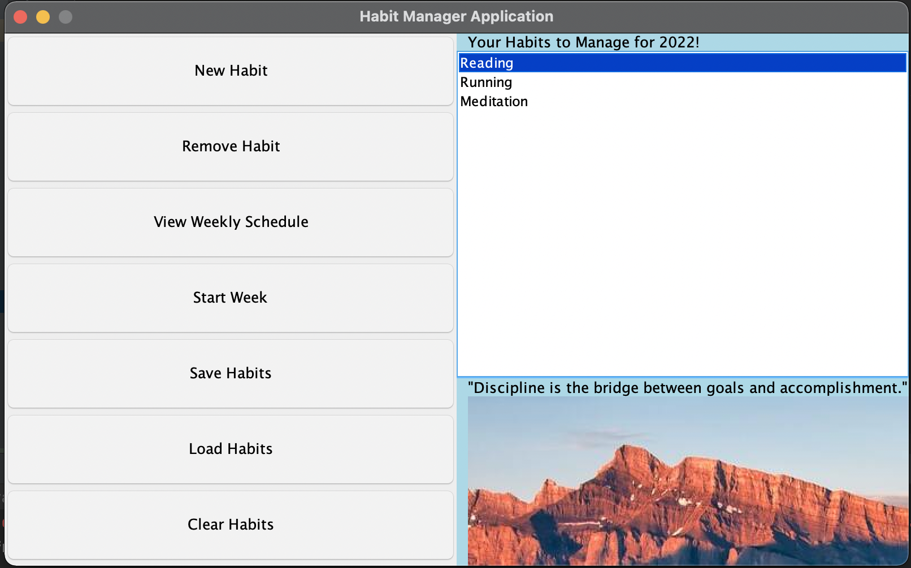
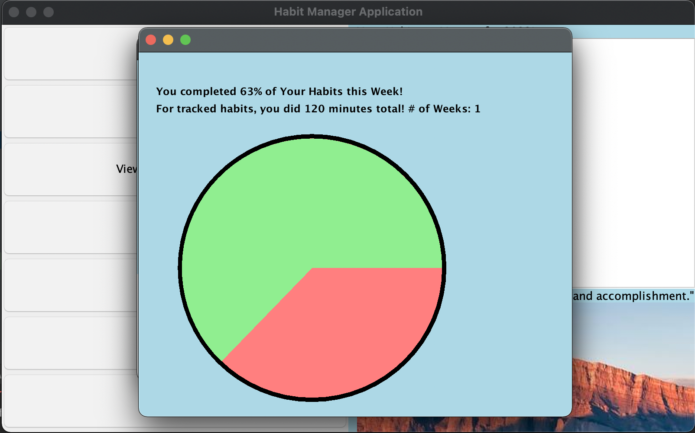

# Weekly Habit Tracker

### User Interface

### Report for Week

*What is my project and who will use it?*

My project is a **habit tracker**. It will keep track of the habits that a person wants to start.
This application can be used by almost any individual wanting to start a new habit for themselves. There are many
types of habits that a person could keep track of which include: lifting weights, running more, sleeping more
consistently, reading more often, spending less money, and many others. Some examples of the possible functionality of
this application include:

*Why am I interested in this?*

This project is of interest to me because with any goal that a person chooses, nothing will happen unless it is turned
into an actionable habit that can be worked on each day. My is to become a good software developer and it is easy
feel intimated by the enormity of that goal. Instead, finding small achievable goals each day brings individuals closer
and closer to the larger goal each day.

User Stories

- As a user, I want to be able to add a habit to my list of habits.
- As a user, I want to be able to view each habit on the list of my habits.
- As a user, I want to be able to delete a habit from my list of habits.
- As a user, I want to be able to see what habits I need to do in the week.
- As a user, I need to be able to start the week and track if I completed a habit or not.
- As a user, I need to be able to see how much time I spent doing these habits in total.
- As a user, I want to be able to save my list of habits to a specific file.
- As a user, I want to be able to load my list of habits from the stored file.
- As a user, I will be able to visualize the stories from Phase 1 in a GUI.
- As a user, I will be able to see a Pie Chart outlining my results for the week.
